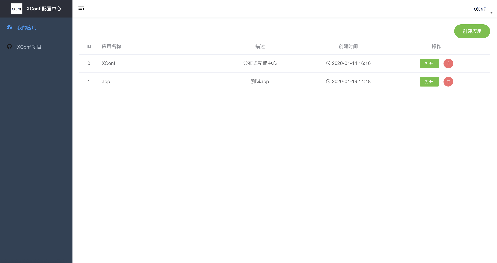
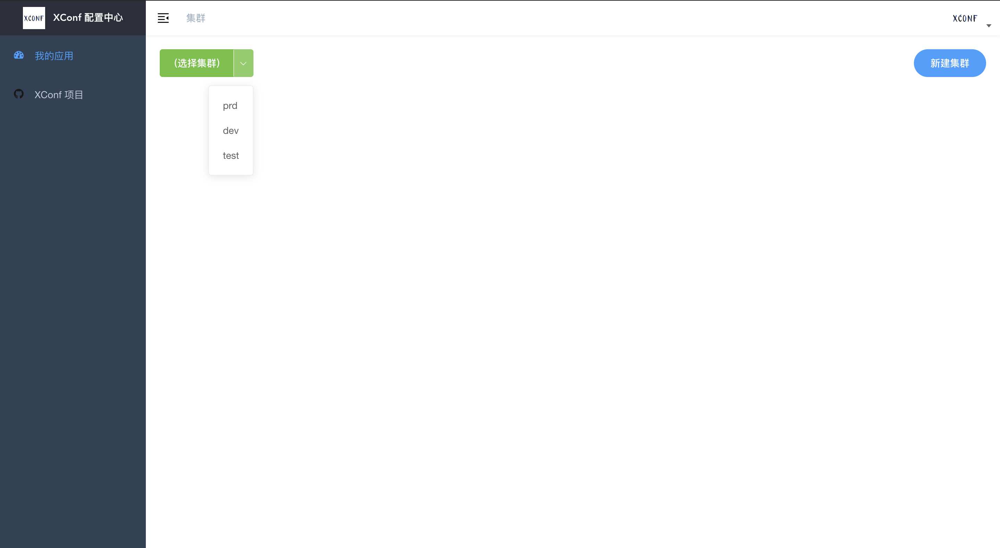
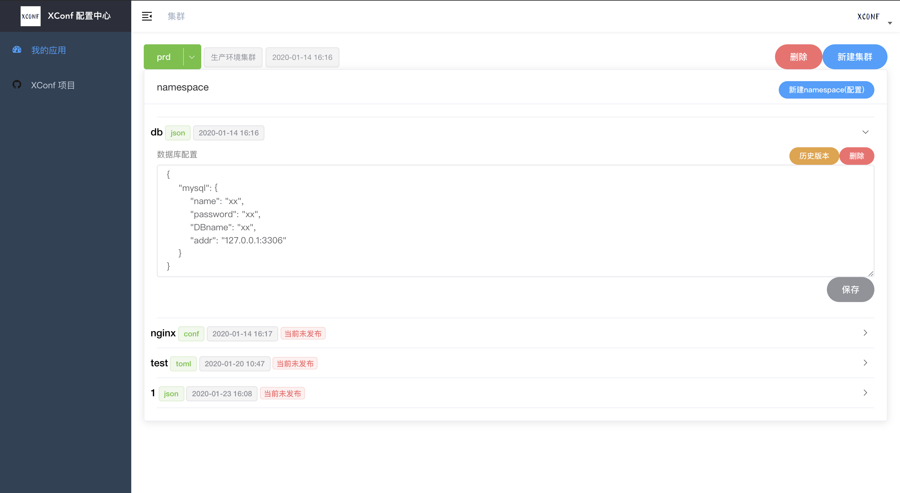
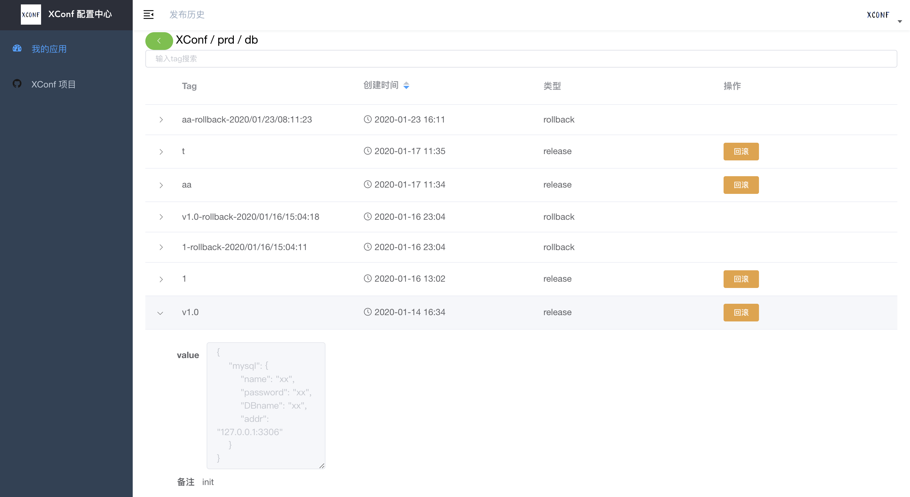

# XConf 分布式配置中心

[](https://github.com/micro-in-cn/XConf/actions)
[](https://goreportcard.com/report/github.com/micro-in-cn/XConf)
[](https://godoc.org/github.com/micro-in-cn/XConf)
[](https://github.com/micro-in-cn/XConf/blob/master/LICENSE)
[](https://img.shields.io/github/languages/code-size/micro-in-cn/XConf.svg?style=flat)

`XConf` 基于 go-micro 构建的分布式配置中心，提供配置的管理与发布、实时推送.

## 特点

- 修改实时推送
- 高效读取配置
- 支持界面管理、配置导入导出
- 安装部署方便，简单

## 服务架构


- App
  - Cluster 集群 （A区，B区，C区）
    - Namespace 空间（可理解为一个个配置文件：db.json，db.toml）
      - Value 配置内容

## 目录结构

```text
.
├── LICENSE
├── README.md
├── admin-api   // 配置管理 api 服务
├── agent-api   // 配置获取，推送服务
├── client      // micro config 客户端插件
├── config-srv  // 配置管理服务
├── dashboard   // 前端UI
├── doc
├── go.mod
├── go.sum
├── micro       // micro api 网关
└── proto
```

## 前端界面

线上 demo - http://xconf.mogutou.xyz/admin/ui









## 快速开始

- 依赖
    
    MySQL XConf 底层存储使用 mysql 数据库

    ```sql
    CREATE DATABASE xconf
    ```
    
    > root:12345@(127.0.0.1:3306)/xconf?charset=utf8&parseTime=true&loc=Local

-  docker 快速启动 all in one
    
    > 所有服务打包到一个容器中，仅仅作为快速预览使用，不可作为生产使用。
    
    ```shell script
    docker pull xuxu123/xconf-all:latest
    ```
    
    ```shell script
    docker run --name xconf -it --rm -p 8080:8080 -e BROADCAST=broker -e DATABASE_URL="root:12345@(IP地址:3306)/xconf?charset=utf8&parseTime=true&loc=Local" xuxu123/xconf-all
    ```
    
    UI： http://127.0.0.1:8080/admin/ui

## 客户端

- Golang  [client/example](client/example/main.go)
    
    ```shell script
    git clone https://github.com/micro-in-cn/XConf.git
    cd XConf/client/example
    go run main.go 
    ```

    客户端支持读取配置，实时获取配置更新（页面上"发布"操作才能触发配置推送，"保存"操作仅是保存配置）
    
## 部署与构建

- [docker compose 部署](https://github.com/micro-in-cn/XConf/tree/master/deployments/docker-compose)

- [源码运行](https://github.com/micro-in-cn/XConf/tree/master/doc/build.md)

## 感谢

XConf 参考了 Apollo 在业界成熟的设计方案。
