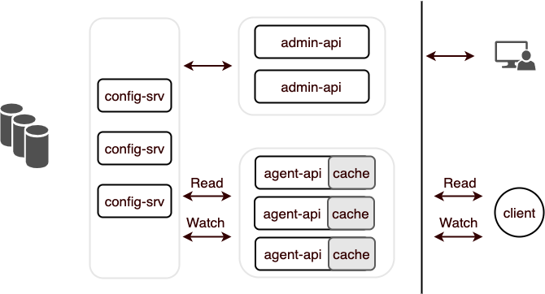

# XConf 分布式配置中心

[](https://github.com/micro-in-cn/XConf/actions)
[](https://goreportcard.com/report/github.com/micro-in-cn/XConf)
[](https://godoc.org/github.com/micro-in-cn/XConf)
[](https://github.com/micro-in-cn/XConf/blob/master/LICENSE)
[](https://img.shields.io/github/languages/code-size/micro-in-cn/XConf.svg?style=flat)

> 持续开发中

`XConf` 基于 go-micro 构建的分布式配置中心，提供配置的管理与发布、实时推送.

## 特点

- 修改实时推送
- 高效读取配置
- 支持界面管理
- 安装部署方便，简单

## 服务架构



- App
    - Cluster 集群 （A区，B区，C区）
        - Namespace 空间（可理解为一个个配置文件：db.json，db.toml）
            - Value 配置内容

## 快速使用（开发版）

### 启动服务

- 依赖： mysql

- micro api 网关
    ```
    micro api --handler=http
    ```

- config-srv 
    >  --database_url value  database url (default: "root:12345@(127.0.0.1:3306)/xconf?charset=utf8&parseTime=true&loc=Local") [$DATABASE_URL]
    
    ```
    cd config-srv
    go run main.go --database_url="root:12345@(127.0.0.1:3306)/xconf?charset=utf8&parseTime=true&loc=Local"
    ```

- agent-api
    ```
    go agent-api
    go run main.go
    ```

- admin-api
    ```
    cd admin-api
    go run main.go
    ```

- client 适配 micro config 的 source 插件
    > micro config 只有在发布内容更改的情况下 watcher.Next 才会返回

    ```
    cd client/example
    go run main.go
    ```

### 测试获取配置

- 创建 app，cluster, namespace 和 更新配置
```
curl -X POST http://127.0.0.1:8080/admin/api/v1/app  -H 'Content-Type: application/json' -d '{ "appName":"app", "description": "测试app"}'
curl -X POST http://127.0.0.1:8080/admin/api/v1/cluster  -H 'Content-Type: application/json' -d '{ "appName":"app", "clusterName": "dev", "description": "测试dev 集群"}'
curl -X POST http://127.0.0.1:8080/admin/api/v1/namespace  -H 'Content-Type: application/json' -d '{ "appName": "app", "clusterName": "dev", "namespaceName": "test", "format": "json", "description": "测试app"}'

curl -X POST http://127.0.0.1:8080/admin/api/v1/config  -H 'Content-Type: application/json' -d '{ "appName": "app", "clusterName": "dev", "namespaceName": "test", "value":  "{\"hosts\":{\"database\":{\"address\":\"11111\",\"port\":2}}}"}'
```

- 发布配置
> 更新配置并不会触发客户端更新推送，只有 发布配置 操作才会推送更新。

```
curl -X POST http://127.0.0.1:8080/admin/api/v1/release  -H 'Content-Type: application/json' -d '{ "appName": "app", "clusterName": "dev",  "namespaceName": "test", "comment": "测试发布"}'
```

- Read ：立即返回

```
curl -X GET 'http://127.0.0.1:8080/agent/api/v1/config?appName=app&clusterName=dev&namespaceName=test' 
```

- Watch ：Http Long Polling 用以实现客户端配置实时推送

```
curl -X GET 'http://127.0.0.1:8080/agent/api/v1/watch?appName=app&clusterName=dev&namespaceName=test&updatedAt=1575559221'
```

## 借鉴 Apollo

XConf 参考了 Apollo 在业界成熟的设计方案。